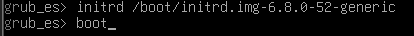
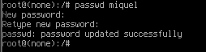
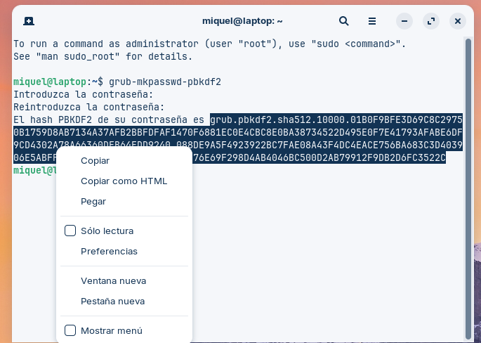
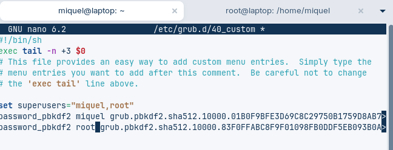
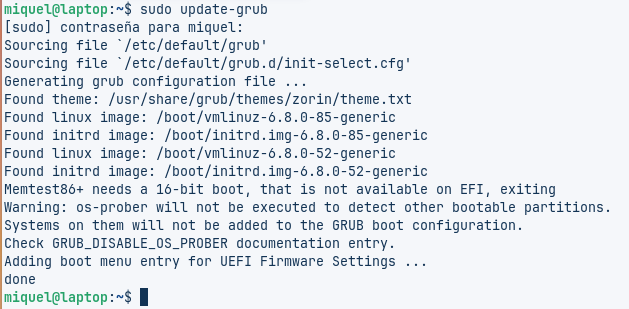
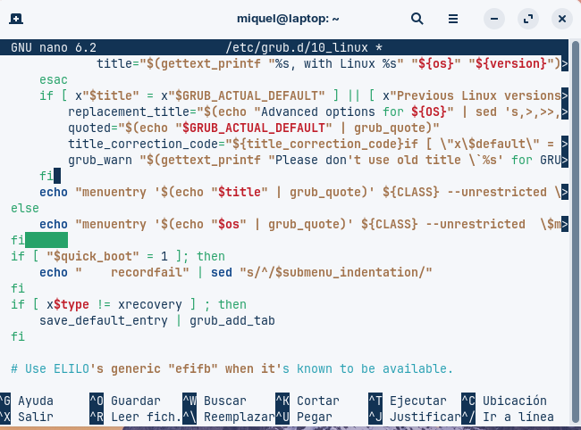
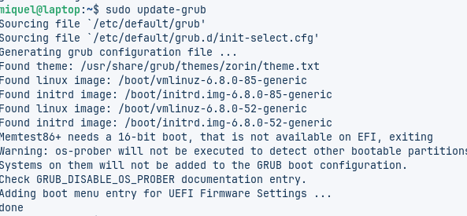

# Guía: Recuperación de Contraseñas y Protección del GRUB en Linux

## Índice

1. Crear la máquina virtual
2. Recuperar contraseña desde GRUB
3. Protección básica del GRUB (contraseña root)
4. Protección avanzada del GRUB (arranque sin contraseña)
5. Notas finales y recomendaciones

---

## 1. Creación de la máquina virtual

Configuraremos una máquina virtual con los recursos necesarios y un disco existente con una imagen ISO previamente preparada, para realizar prácticas de recuperación de contraseñas y protección del GRUB.

### Pasos detallados:

1. Crea una nueva máquina virtual con:
   - **8 GB de memoria RAM**
   - **2 procesadores**
2. En el apartado **Hard Disk**, selecciona:  
   `Use an existing virtual hard disk file`
3. Elige el disco que contiene la ISO previamente creada.
4. Guarda la configuración y arranca la máquina.

### 📝 Notas importantes:

- No es necesario crear un disco nuevo; usaremos uno ya existente.
- Verifica que la imagen seleccionada sea la correcta y compatible con el sistema operativo.

---

## 2. Cambio de contraseña mediante GRUB

Este procedimiento permite restablecer la contraseña de un usuario Linux cuando se ha perdido el acceso, utilizando el modo `root` a través del GRUB.

### Pasos detallados:

1. Reinicia la máquina y presiona `Esc` repetidamente para acceder al menú del GRUB.
2. Selecciona la entrada de Linux deseada y presiona `e` para editarla.
3. Sustituye las líneas del arranque por las siguientes:

   ```bash
   linux /boot/vmlinuz-6.8.0-52-generic root=/dev/sda3 rw init=/bin/bash
   initrd /boot/initrd.img-6.8.0-52-generic
   boot


   > ⚠️ Estas líneas inician una sesión `root` sin contraseña.

5. Una vez dentro del sistema, ejecuta el siguiente comando para cambiar la contraseña del usuario:

    ```bash
    passwd miquel
    ```

6. Introduce y confirma la nueva contraseña.
7. Reinicia la máquina normalmente (`Ctrl + Alt + Del` o `reboot` si estás en bash).
8. Inicia sesión con la nueva contraseña.

### ⚠️ Notas importantes

- Este método **solo funciona** si el GRUB **no está protegido** con contraseña.
- Debe usarse **únicamente** con fines de recuperación o administración autorizada.

---

## 3. Protección básica del GRUB

Este paso asegura el GRUB estableciendo una contraseña de administrador para impedir cambios no autorizados en las opciones de arranque.

### Pasos detallados:

1. Genera una contraseña cifrada ejecutando:

    ```bash
    grub-mkpasswd-pbkdf2
    ```

2. Escribe y confirma la contraseña. El sistema generará un hash similar a:

    ```
    PBKDF2 hash of your password is grub.pbkdf2.sha512.10000.<hash>
    ```

3. Copia el hash generado.

4. Edita el archivo de configuración personalizado del GRUB:

    ```bash
    sudo nano /etc/grub.d/40_custom
    ```

5. Al final del archivo, agrega las siguientes líneas:

    ```bash
    set superusers="root"
    password_pbkdf2 root <hash>
    ```


    > Reemplaza `<hash>` por el hash que copiaste en el paso anterior.

6. Guarda y cierra el archivo (`Ctrl + O`, `Enter`, `Ctrl + X`).

7. Actualiza la configuración del GRUB:

    ```bash
    sudo update-grub
    ```


8. Reinicia la máquina.

### ⚠️ Notas importantes

- Tras reiniciar, el GRUB solicitará **usuario y contraseña** incluso para un arranque estándar.
- Mejora significativamente la seguridad, aunque puede resultar incómodo para algunos usuarios.

---

## 4. Protección avanzada del GRUB

Permite arrancar el sistema normalmente sin solicitar contraseña, pero restringe el acceso a las opciones avanzadas o de edición del GRUB.

### 🧭 Pasos detallados

1. Edita el archivo de configuración de GRUB:

    ```bash
    sudo nano /etc/grub.d/10_linux
    ```


2. Busca las líneas que contienen `menuentry` presionando `Ctrl + W` y escribiendo:

    ```
    menuentry
    ```

3. En cada línea `menuentry`, añade la opción `--unrestricted` después del parámetro `${CLASS}`. Por ejemplo:

    ```bash
    menuentry 'Ubuntu' --class ubuntu --class gnu-linux --class gnu --class os --unrestricted {
    ```


4. Guarda los cambios (`Ctrl + O`, `Enter`, `Ctrl + X`).

5. Regenera la configuración del GRUB:

    ```bash
    sudo update-grub
    ```


6. Reinicia la máquina para aplicar los cambios.

    ```bash
    sudo reboot
    ```


### ✅ Resultado esperado

- El sistema arrancará normalmente **sin solicitar contraseña**.
- Si se intenta acceder al modo de recuperación, edición o consola GRUB, **sí se solicitará** usuario y contraseña.

### ⚠️ Notas importantes

- Esta configuración ofrece un buen **equilibrio entre seguridad y usabilidad**.
- Ideal para entornos donde se requiere protección, pero sin obstaculizar el arranque diario.

---

## 5. 📝 Notas finales

- La manipulación del GRUB y del acceso `root` debe realizarse con extrema precaución.
- Siempre es recomendable contar con copias de seguridad del sistema antes de realizar estos cambios.
- Estas configuraciones están destinadas a usuarios con **permisos administrativos** o personal técnico autorizado.

---
